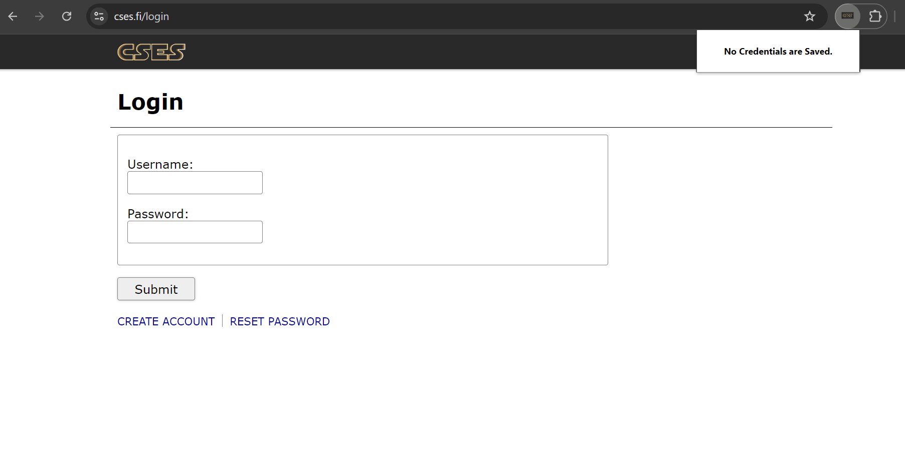

# **CSES Auto-Login Extension**

This Chrome extension automatically saves your CSES username and password when you log in and autofills them on your next visit. It's designed to save time by streamlining the login process, especially useful for those frequently accessing the CSES site.

## **Features**
- Automatically fills in your saved credentials on the CSES login page.
- Securely stores your username and password using Chrome’s sync storage.
- One-click clearing of saved credentials via the extension popup.
  
## **How It Works**
1. When you log in to the [CSES](https://cses.fi/login) website, the extension saves your username and password.
2. On your next visit to the CSES login page, it will automatically populate the login form with your saved credentials.
3. You can clear your saved credentials at any time using the extension popup.

## **Installation**
1. Clone this repository to your local machine:
   ```
   git clone https://github.com/yourusername/cses-auto-login.git
   ```
2. Open Chrome and navigate to `chrome://extensions/`.
3. Enable **Developer Mode** by clicking the toggle switch in the top right corner.
4. Click on the **Load unpacked** button and select the directory where you cloned the repository.
5. The extension will now be available in Chrome.

## **Usage**
1. Navigate to the [CSES Login Page](https://cses.fi/login).
2. Enter your username and password as you normally would.
3. The extension will save your credentials when you submit the login form.
4. On future visits, the extension will automatically fill in your credentials for you.
5. To clear your saved credentials, click on the extension icon and use the **Clear** button.

## **Screenshots**
### 1. **Login Page when Credentials are not Saved**


### 2. **When You Login Once Your Credentials are Saved**


## **Development**
If you want to modify or contribute to this project:
1. Make sure you have a basic understanding of Chrome extensions, JavaScript, HTML, and CSS.
2. Follow the installation steps to load the extension locally.
3. Any changes you make to the code will be reflected in the extension after reloading it in the Chrome extensions page.

## **Contributing**
Pull requests are welcome! Feel free to open an issue first to discuss what you would like to change.

<!-- ## **License** -->
<!-- This project is licensed under the MIT License - see the [LICENSE](LICENSE) file for details. -->